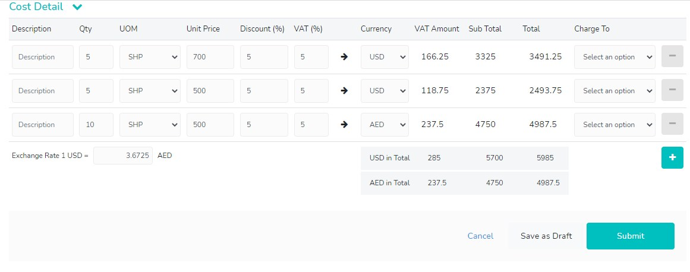

# tesUIVUE
<p align="center">

</p>

### Installation

1. Clone the repo
   ```sh
   git clone https://github.com/mrizaldesign/tesUIVUE.git
   ```
2. Install NPM packages
   ```sh
   npm install
   ```
3. Run php artisan
   ```sh
   php artisan serve
   ```